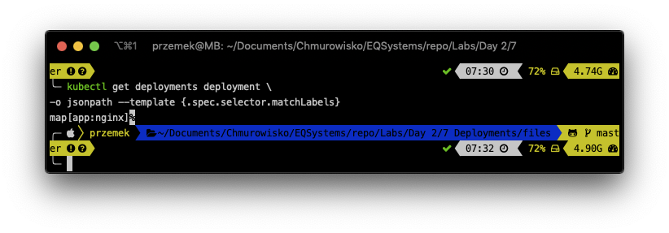

  
  
  

# Deployments

## LAB Overview

#### In this lab you will work with Deployments

## Task 1: Creating a Deployment

In this task you will create a deployment containing twree replicas od nginx.

1. Create new file by typing `nano deployment.yaml`.
2. Download [manifest file](./files/deployment.yaml) and paste its content into editor.
3. Save changes by pressing _CTRL+O_ and _CTRL-X_.
4. Type `kubectl apply -f deployment.yaml` and press enter.

## Task 2: Exploring Deployment

The Deployment is managind ReplicaSet. Let's see the label selector used by Deployment.

1. Run following command:

`kubectl get deployments deployment -o=jsonpath='{.spec.selector.matchLabels}'`
 2. The Deployment is managing a ReplicaSet with the label app=nginx. Find that ReplicaSet by running command: `kubectl get replicasets --selector=app=nginx`
You can see, that you have 3 replicas in your Deployment and in your ReplicaSet.
 3. Scale the deployment by running:

`kubectl scale deployments deployment --replicas=4`

4. Get the list of Pods inside ReplicaSet: `kubectl get replicasets --selector=app=nginx`
   As expected you have 4 replicas of nginx Pod.
   
5. Let’s try the opposite, scaling the ReplicaSet. Replace the ReplicaSet name with yours (you can find it using this command: ''kubectl get replicasets --selector=app=nginx'' ) and execute following command:
   `kubectl scale replicasets <-REPLICASET-NAME-> --replicas=1`
6. Get the list of Pods inside ReplicaSet once again: `kubectl get replicasets --selector=app=nginx`
   "Unexpectedly" you have still 4 replicas of the Pod.
   
   Remember, Kubernetes is self-healing system. The top-level Deployment object is managing this ReplicaSet. When you adjust the number of replicas to one, it no longer matches the desired state of the deployment, which has replicas set to 4.

7. Please delete the deployment: `kubectl delete -f deployment.yaml`

## END LAB

  

&copy; 2021 Chmurowisko Sp. z o.o.

